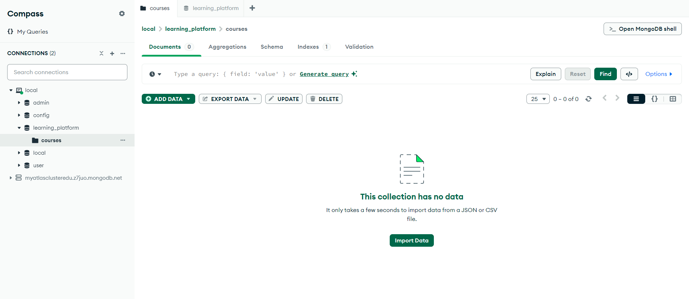
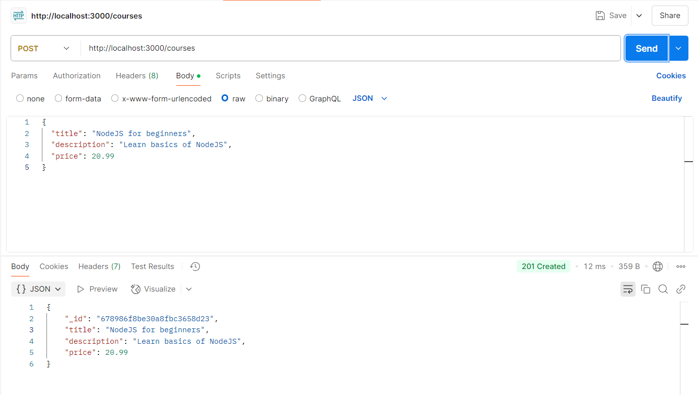
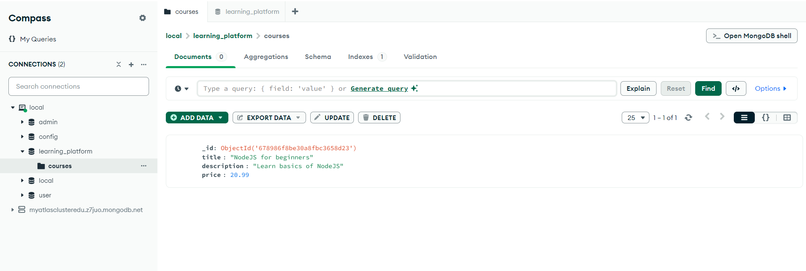
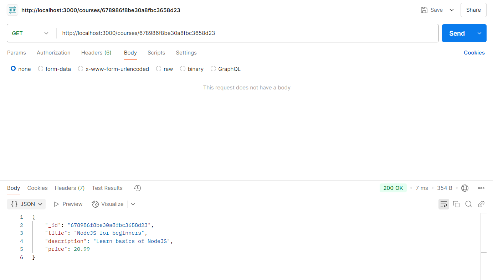
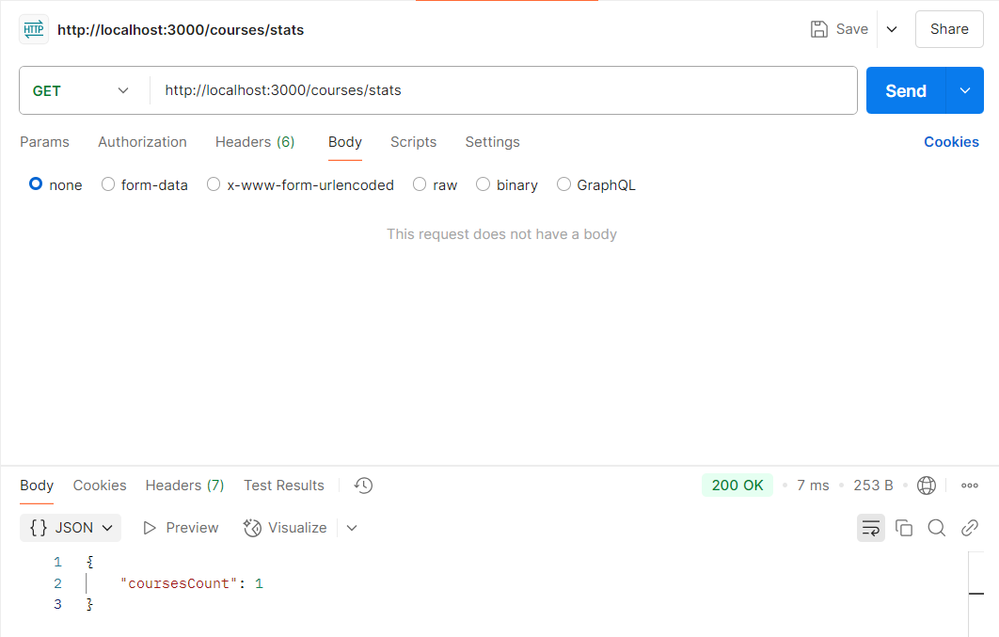

# **Learning Platform NoSQL**

Ce projet est une application backend destinée à la gestion des cours. Elle propose des fonctionnalités comme la création de cours, la recherche par ID et des statistiques sur les cours.

---

## **Structure du Projet**

- **`config/`** : Gestion des connexions aux bases de données (MongoDB, Redis) et des variables d'environnement.
- **`controllers/`** : Contient la logique métier des entités (ex. : `CourseController`).
- **`routes/`** : Définit les points d'entrée API pour chaque ressource.
- **`services/`** : Fournit des utilitaires pour manipuler les données.
- **`app.js`** : Point d'entrée principal de l'application.

---


## **Réponses aux Questions Techniques**

### **`config/db.js`**
1. **Pourquoi utiliser un module séparé pour les connexions aux bases de données ?**
   - Pour centraliser et standardiser la gestion des connexions, réduire la duplication de code et faciliter la maintenance.
2. **Comment gérer proprement la fermeture des connexions ?**
   - En capturant les événements système (`SIGTERM`) pour libérer les ressources avant l'arrêt de l'application.

### **`config/env.js`**
1. **Pourquoi valider les variables d'environnement au démarrage ?**
   - Pour garantir que toutes les configurations nécessaires sont disponibles et éviter des erreurs imprévues.
2. **Que faire si une variable requise est absente ?**
   - L'application doit stopper avec un message d'erreur explicite pour éviter des comportements imprévisibles.

### **`controllers/courseController.js`**
1. **Différence entre un contrôleur et une route :**
   - Une route définit l'URL et le type de requête (GET, POST, etc.), tandis qu'un contrôleur contient la logique métier associée.
2. **Pourquoi séparer la logique métier des routes ?**
   - Cela améliore la lisibilité, facilite la maintenance et simplifie les tests unitaires.

### **`routes/courseRoutes.js`**
1. **Pourquoi séparer les routes dans des fichiers distincts ?**
   - Pour faciliter la gestion et rendre les routes plus lisibles, surtout pour des applications complexes.
2. **Comment organiser les routes de manière cohérente ?**
   - Grouper les routes par fonctionnalité ou module (par exemple, un fichier `courseRoutes.js` pour les routes liées aux cours).

### **`services/mongoService.js`**
1. **Pourquoi utiliser des services séparés ?**
   - Pour centraliser la logique de manipulation des données et la rendre réutilisable à travers l'application.

### **`services/redisService.js`**
1. **Comment gérer efficacement le cache avec Redis ?**
   - Définir des clés avec une durée d'expiration (TTL) et invalider les données obsolètes.
2. **Bonnes pratiques pour les clés Redis :**
   - Utiliser des noms descriptifs avec des préfixes pour éviter les collisions (ex. : `courses:<id>`).

### **`app.js`**
1. **Comment organiser le point d'entrée de l'application ?**
   - Initialiser les connexions, configurer les middlewares, et monter les routes avant de démarrer le serveur.
2. **Comment gérer les erreurs au démarrage ?**
   - Utiliser des blocs `try-catch` pour capturer et signaler les erreurs lors de l'initialisation.

### **`.env`**
1. **Quelles informations sensibles éviter de commiter ?**
   - Mots de passe, clés API, certificats, configurations sensibles, etc. Utilisez un fichier `.gitignore` et des gestionnaires de secrets.
2. **Pourquoi utiliser des variables d'environnement ?**
   - Elles permettent de séparer la configuration de l'application, garantissant ainsi la sécurité et la flexibilité.

---


## **Choix Techniques et Justifications**

### **`app.js`**
- **Initialisation des connexions** : Assure un accès aux données avant le démarrage de l'application.
- **Configuration des middlewares** : Modularité et gestion centralisée des requêtes/réponses.
- **Montage des routes** : Préparation des points d'entrée avant la mise en ligne du serveur.
- **Fermeture propre des connexions** : Libère les ressources pour éviter les fuites.

### **`config/env.js`**
- **Validation des variables** : Empêche des erreurs dues à des configurations manquantes.
- **Erreurs explicites** : Facilite le débogage en cas de problème.

### **`services`**
- **Fonctions réutilisables** : Centralisent la logique de manipulation des données pour une meilleure maintenabilité.
- **Cache Redis** : Optimise les performances grâce à une gestion efficace des données mises en cache.

### **`controllers`**
- **Séparation des préoccupations** : Distingue clairement la logique métier des définitions de routes.

---


## **Instructions pour Démarrer le Projet**

### **Étapes Préparatoires**
1. Assurez-vous que MongoDB est installé et en cours d'exécution sur votre machine.
   - Si ce n'est pas le cas, démarrez MongoDB avec la commande appropriée.

### **Lancer l'Application**
1. Exécutez la commande suivante :
   ```bash
   npm start
   ```


### **Tester l'API avec Postman**
1. **Base de données vide :**
   - Initialement, aucune donnée n'est présente.
   - Exemple d'aperçu :
     

2. **Ajout de cours :**
   - Utilisez Postman pour insérer des cours dans la base.
     

3. **Vérification dans MongoDB Compass :**
   - Confirmez que les cours ont été ajoutés.
     

4. **Recherche par ID :**

     

5. **Statistiques des cours :**

     

